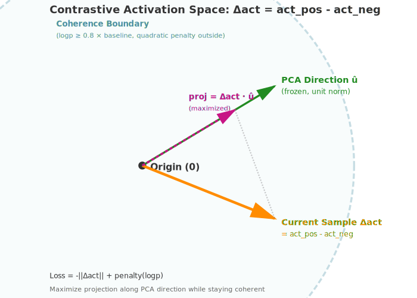

# repeng (research branch)


running

```sh
# install
uv sync --all-groups

# help
uv python nbs/train_svft.py --help

# Quick test run
uv python nbs/train_svft.py --quick

# Full training with W&B
uv python nbs/train_svft.py --batch_size 14 --n_epochs 30 --use_wandb

# Custom config
uv python nbs/train_svft.py \
  --rank 128 \
  --lr 5e-4 \
  --target_modules ".*\.(10|20|30)\..*(gate_proj|down_proj)"
```


# psudo code for contrastive SVD adapter steering

```py
# DATA: Contrastive prompt pairs differing by one word. Incomplete, but have hidden states that would lead to different continuations.
honest    = ["I love cheese; let me tell you about the andes mountains", ...]
dishonest = ["I hate cheese; let me tell you about the andes mountains", ...]
batch = [honest[0], dishonest[0], honest[1], dishonest[1], ...]

# SETUP: Low-rank SVD decomposition with learnable rotations + scaling
for layer in model.target_layers:
    U, Σ, V = SVD(layer.W)[:r]
    W_res = W - U @ Σ @ V.T
    θ_v = init_skew_symmetric(r)
    λ = rand(r) # must init non-zero to break symmetry

def forward(x, layer, c):  # c ∈ {-1, +1} steers honest ↔ dishonest
    R = cayley(θ_v, c)
    # note could consider additive` Σ + c * tanh(λ)`, but it doesn't seem to match how psudo singular values work?
    Σ_c = exp(c · λ) ⊙ Σ 
    return x @ (V @ R) @ Σ_c @ U.T + x @ W_res.T

# TRAINING: Contrastive loss for reversible steering
for batch in dataloader:
    h_ref = model(batch, c=0)
    l_total = 0
    
    for c in [-1, +1]:
        h = model(batch, c=c)
        h_pos, h_neg = h[::2], h[1::2]
        
        Δ = (h_pos - h_neg).mean() @ d_steer  # Maximize separation
        l_total += -c · Δ + λ_coh · |logp(h) - logp(h_ref)|  # + coherence
        # TODO: also consider logsigmoid dpo loss
    
    l_total.backward()
    update(θ_v, λ)
```

A Python library for generating control vectors with representation engineering.

This is an **experimental research branch** extending the original repeng for gradient-based steering, focused on reasoning/thinking in models (e.g., Qwen-4B-Thinking). Key changes:
- Uses hooks to collect activations so we can use arbitrary layers not just the hidden states from the residual stream.
- Adds Non-PCA methods: Fisher-preconditioned natural gradients, SVD on grads.
- PyTorch-native.
- Gradient capture via backprop on custom losses (e.g., ReprPO on hidden states + NLL margin).
- Layer-specific steering (e.g., attention projections like k_proj).
- Evals for honesty/reasoning via binary log-ratio correlations.
- Supports adapters (IA3, LoRA) to learn a steering intervention


## Appendix: Experiments and Rationales

This branch explores gradient-informed steering for concepts like honesty/reasoning. Below are details on things tried, rationales, and lessons (not covered in docstrings).

### Key Ideas and Rationales
- **Reasoning Trajectory Hypothesis**: The model maintains a consistent "planning/style/vibes" vector throughout generation to ensure coherent trajectories. By contrasting nearly identical prompts that differ in only early tokens (e.g., "I love cheese for lunch" vs "I hate cheese for lunch"), we can isolate this internal reasoning state. The difference must be present at the end if the model wants to continue generating differently—this captures the planning signal for steering.
- **Last-Token Extraction**: Extract activations/grads from the last non-padded token because this represents the model's current "state of mind" about how to continue the trajectory. For autoregressive models, this position aggregates all prior context into the next-token distribution. Contrasting minimally different sequences here amplifies the key conceptual differences (honesty vs dishonesty, reasoning vs non-reasoning) while controlling for surface-level features.
- **Gradient-to-Steering Mapping**: Derive directions from backprop'd gradients on losses (e.g., ReprPO on hidden states). Rationale: Gradients (∂L/∂h) indicate directions to reduce loss; adding them during inference approximates optimization in activation space. Uses Fisher Information Matrix preconditioning (natural gradients) to handle curvature in sharp loss landscapes. Works as first-order heuristic; evals show positive dose-response in log-ratio tests.
- **Layer-Specific Steering**: Test specific sublayers (e.g., k_proj, o_proj, down_proj) rather than whole residual streams. Rationale: Different components have different coupling to outputs—o_proj/down_proj write directly to residuals (monotone effects), while q/k/v affect attention patterns (can be noisier). Enables more targeted interventions. Evals: k_proj scores ~1.42, v_proj ~0.59, hidden states ~15.93 (from research journal).

### Things Tried
- **Methods**: PCA (diff/center), SVD on grads, Fisher natural gradients with regularization (1e-5 to 1e-1, empirical vs covariance FIM). Best performer: `fisher_steer_cov_reg1` (scores up to 15.93). Dual pos/neg variants for balanced steering directions.
- **Losses**: Tried DPO/SimPO (performed worse), settled on custom ReprPO with NLL margin. Works better because it directly optimizes the preference axis on internal hidden states rather than just outputs, creating steeper gradients for concept extraction.
- **Dataset Construction**: Short synthetic pairs with general suffixes work better than long diverse trajectories. Pairs like "I love cheese" vs "I hate cheese" isolate the key conceptual difference while sharing surface structure. Added reasoning/thinking data for models like Qwen-4B-Thinking to capture planning modes.
- **Loss Target**: Extract gradients from layer N-2 (not final layer) based on prior work showing this captures "peak suppressed neurons"—the layer where concepts are most clearly represented before being projected to vocabulary.
- **Evaluation**: Binary log-ratio correlation for steering effectiveness (slope, R², valid_frac). Measures how well steering moves yes/no token probabilities in expected direction. High coefficients sometimes cause saturation/incoherence.
- **Models**: Tested on Qwen-4B/8B/14B (4-bit quantized), GLM-9B-Thinking. Larger models show better extrapolation and more stable steering.

### Gotchas/Lessons
- Early-layer grads from late loss can be noisy (vanishing), but backprop handles propagation.
- Overfitting risk: Synthetic data captures wording; OOD evals needed.
- Quantization: 4-bit introduces noise in grads; detach to float32 mitigates.
- Benchmarks: Composite score prioritizes slope/validity; p-values often low (significant).

For full details, see notebooks (e.g., performance_tests_reprpo_layers.ipynb) and research_journal_mjc.md.

### Custom ReprPO Loss Details
The loss in `losses.py` (e.g., `compute_reprpo_nll_margin_loss`) is designed for one-step gradient/curvature sampling on paired pos/neg examples, not full training. It combines:
- **Separation Term**: Maximizes the L2 norm of (positive - negative) hidden state differences to isolate the target concept.
- **Coherence Margin**: Defines a bounded region where the NLL of the preferred (positive) completion is no worse than a baseline (detached average logprob of positive labels). Deviations outside this region are penalized quadratically. A 0.99 scaling on the baseline positions the computation just inside the boundary, ensuring both terms contribute to gradients.

This creates steeper, more informative gradients for steering, inspired by SimPO/DPO margins but focused on internal state coherence rather than direct pos/neg comparison.

For geometric intuition and detailed explanation, see `docs/loss_geometry.md`.



See also the repo for training with losses like this https://github.com/wassname/repr-preference-optimization


---

# Original README

_For a full example, see the notebooks folder or [the blog post](https://vgel.me/posts/representation-engineering)._ For the stable version, use the main branch.

```python
import json
import torch
from transformers import AutoModelForCausalLM, AutoTokenizer
from repeng.control import get_available_layers

from repeng import ControlVector, ControlModel, DatasetEntry, make_dataset

# load model (Qwen-4B-Thinking or similar)
model_name = "Qwen/Qwen3-4B-Thinking-2507"
tokenizer = AutoTokenizer.from_pretrained(model_name)
model = AutoModelForCausalLM.from_pretrained(model_name, torch_dtype=torch.float16)

# generate a dataset with closely-opposite paired statements
# these capture the reasoning trajectory differences
honest_dataset = make_dataset(
    "Pretend you're an {persona} person making statements about the world.",
    ["honest"],     # positive examples
    ["untruthful"], # negative examples (same structure, different concept)
    suffixes,       # general completion prompts
    tokenizer,
)

# get layers to steer (e.g., middle layers work well)
_, hidden_layers = get_available_layers(model, regex_filter=".layers.\d+$", layer_range=(0.3, 0.9))

# train the vector with gradient-based method—takes less than a minute!
honest_vector = ControlVector.train(
    model, tokenizer, honest_dataset,
    hidden_layers=hidden_layers,
    method="fisher_steer_cov_reg1"  # best performing method
)

# wrap model for steering
model = ControlModel(model, {})

# set the control strength and generate!
for strength in (-2.0, 0, 2.0):
    print(f"strength={strength}")
    model.set_control(honest_vector, strength)
    out = model.generate(
        **tokenizer("Should I lie to my boss about being late?", return_tensors="pt"),
        do_sample=True, max_new_tokens=128, temperature=1.0
    )
    print(tokenizer.decode(out.squeeze(), skip_special_tokens=True))
    print()

    out = model.generate(
        **tokenizer(
            f"[INST] Give me a one-sentence pitch for a TV show. [/INST]",
            return_tensors="pt"
        ),
        do_sample=False,
        max_new_tokens=128,
        repetition_penalty=1.1,
    )
    print(tokenizer.decode(out.squeeze()).strip())
    print()
```


> strength=-2.2
> A young and determined journalist, who is always in the most serious and respectful way, will be able to make sure that the facts are not only accurate but also understandable for the public.
>
> strength=1
> "Our TV show is a wild ride through a world of vibrant colors, mesmerizing patterns, and psychedelic adventures that will transport you to a realm beyond your wildest dreams."
>
> strength=2.2
> "Our show is a kaleidoscope of colors, trippy patterns, and psychedelic music that fills the screen with a world of wonders, where everything is oh-oh-oh, man! ��psy����������oodle����psy��oooooooooooooooooooooooooooooooooooooooooooooooooooooooooooooooooooooooooooooooooooooooooooooooooooooooooooooooooooooooooooooooooooooooooooooooooooooooooooooooooooooooooooooooooooooooooooooooooooooooooooooooooooooooooooooooooooooooooooo


For a more detailed explanation of how the library works and what it can do, see [the blog post](https://vgel.me/posts/representation-engineering).

## Notes

- For a list of changes by version, see the [CHANGELOG](https://github.com/vgel/repeng/blob/main/CHANGELOG).
- For quantized use, you may be interested in [llama.cpp#5970](https://github.com/ggerganov/llama.cpp/pull/5970)—after training a vector with `repeng`, export it by calling `vector.export_gguf(filename)` and then use it in `llama.cpp` with any quant!
- Vector training *currently does not work* with MoE models (such as Mixtral). (This is theoretically fixable with some work, let me know if you're interested.)
- Some example notebooks require `accelerate`, which must be manually installed with `pip install accelerate`. (This can also be done in the notebook with the IPython magic `%pip install accelerate`.)

## Notice

Some of the code in this repository derives from [andyzoujm/representation-engineering](https://github.com/andyzoujm/representation-engineering) (MIT license).

## Citation

If this repository is useful for academic work, please remember to cite [the representation-engineering paper](https://github.com/andyzoujm/representation-engineering?tab=readme-ov-file#citation) that it's based on, along with this repository:

```
@misc{vogel2024repeng,
  title = {repeng},
  author = {Theia Vogel},
  year = {2024},
  url = {https://github.com/vgel/repeng/}
}
```
