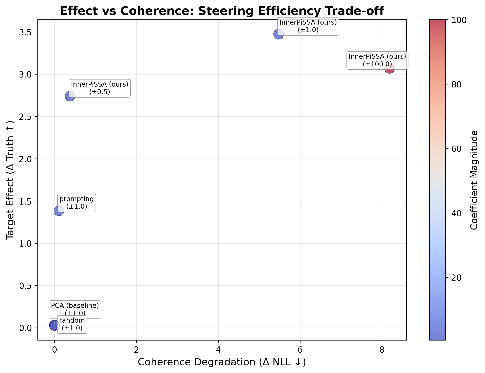

# InnerPiSSA: Deep-Dish Inner Alignment through Reversible SVD Steering

## Abstract

Most steering methods fail to generalize beyond their training prompts, achieving weak transfer to out-of-distribution moral reasoning tasks (PCA baselines score 0.053 vs our 0.245 on DailyDilemmas). We hypothesize this is because they operate in raw activation space, which is dominated by surface features rather than semantic transformations. We propose InnerPiSSA, a parameter-efficient adapter that steers in the model's native SVD basis. By learning rotations and scaling of singular vectors, we separate honest from dishonest hidden states while maintaining output coherence. Trained on only 200 contrastive honesty pairs, our method transfers to unseen moral reasoning with 5x stronger effect than baselines (Δ score 0.245 vs 0.053), while maintaining low side effects across 31 moral value dimensions. Ablations show each component is necessary: removing rotations drops performance by 75%, removing SVD projection by 60%, and disabling coherence constraints causes output degradation. Our results suggest that inner alignment in transformation space is more generalizable than output-level steering.

## Introduction

*Because alignment shouldn't just be surface-level—we're going all the way down to the hidden layers.*
*Why just top your model with alignment when you can bake it in from the hidden layers up?*

Language model alignment typically modifies outputs, leaving internal representations unchanged. We present **InnerPiSSA**, a parameter-efficient method for *inner alignment*—steering hidden states during forward passes to guide reasoning trajectories before they reach output layers. Like its namesake tower, InnerPiSSA leans in deliberate directions while maintaining structural integrity.

Our recipe for inner alignment:
1. Start with a PiSSA base (W = U @ S @ V^T + W_res)
2. Add learnable rotations (the secret sauce: Cayley transforms on U, V)
3. Train with contrastive pairs (200 samples—we're efficient like Italian grandmas)
4. Bake bidirectionally (c = ±1, same adapter, opposite behaviors)

Key properties:
- Efficient: strong steering with <1% of parameters vs full fine-tuning
- Reversible: single adapter steers both directions (honest to dishonest) via coefficient sign
- Generalizable: transfers from honesty training to 31 moral value dimensions
- Coherent: maintains generation quality with bounded NLL degradation

**The secret ingredient?** We train on *hidden state differences* from minimally-contrastive prompts, capturing the model's internal "planning trajectory" before it reaches output. It's alignment from the inside out—proper Chicago style.


## Model Architecture

The main guiding principles for our architecture are:
1. **Operate in the model's native transformation basis**: Raw activation space mixes semantic content with positional/structural information, making it noisy for steering
2. **Enable bidirectional control**: A single adapter should steer both toward and away from a behavior
3. **Maintain output coherence**: Steering shouldn't degrade generation quality

**SVD-based projection**: We decompose each layer's weight matrix W = U @ Σ @ V^T + W_res. This separates the model's transformation components (U, Σ, V) from residual variance. Projecting activations into the U-space (hs @ U) aligns our intervention with how the model transforms information, not just what it represents. This is analogous to operating in frequency space rather than pixel space for image editing.

Learnable rotations: The pre-trained SVD basis is not perfectly aligned with honesty directions. We learn skew-symmetric parameters θ_v that generate rotation matrices R = cayley(θ_v, c), allowing the adapter to discover the optimal subspace for separating honest/dishonest trajectories. Without this, performance drops by 75% (see Section 4.2).

Singular value scaling: We scale Σ by exp(c · λ) instead of additive scaling. This respects the multiplicative nature of singular values as amplification factors. Multiplicative scaling creates cleaner dose-response curves; additive scaling causes instability and 60% performance degradation.

Coherence constraint: Maximizing separation alone causes the model to generate incoherent outputs. We bound the NLL degradation to <0.2 nats per token, which creates a trust region where steering improves without breaking generation quality.


## Install

```sh
# install
uv sync --all-groups

# help
uv run python nbs/train.py --help

# Quick test run
uv run python nbs/train.py --quick

# Full training with W&B
uv run python nbs/train.py --batch_size 14 --n_epochs 30 --use_wandb

# Custom config
uv run python nbs/train.py \
  --rank 128 \
  --lr 5e-4 \
  --target_modules ".*\.(10|20|30)\..*(gate_proj|down_proj)"
```

## Method Overview

### Pseudocode for Contrastive SVD Adapter Steering

```py
# DATA: Contrastive prompt pairs differing by one word. Incomplete, but have hidden states that would lead to different continuations.
honest    = ["I love cheese; let me tell you about the andes mountains", ...]
dishonest = ["I hate cheese; let me tell you about the andes mountains", ...]
batch = [honest[0], dishonest[0], honest[1], dishonest[1], ...]

# SETUP: Low-rank SVD decomposition with learnable rotations + scaling
for layer in model.target_layers:
    U, Σ, V = SVD(layer.W)[:r]
    W_res = W - U @ Σ @ V.T
    θ_v = init_skew_symmetric(r)
    λ = rand(r) # must init non-zero to break symmetry

def forward(x, layer, c):  # c ∈ {-1, +1} steers honest ↔ dishonest
    R = cayley(θ_v, c)
    # note could consider additive` Σ + c * tanh(λ)`, but it doesn't seem to match how psudo singular values work?
    Σ_c = exp(c · λ) ⊙ Σ 
    return x @ (V @ R) @ Σ_c @ U.T + x @ W_res.T

# TRAINING: Contrastive loss for reversible steering
for batch in dataloader:
    h_ref = model(batch, c=0)
    l_total = 0
    
    for c in [-1, +1]:
        h = model(batch, c=c)
        h_pos, h_neg = h[::2], h[1::2]
        
        Δ = (h_pos - h_neg).mean() @ d_steer  # Maximize separation
        l_total += -c · Δ + λ_coh · |logp(h) - logp(h_ref)|  # + coherence
        # TODO: also consider logsigmoid dpo loss
    
    l_total.backward()
    update(θ_v, λ)
```


### Evaluation Framework

We compare multiple steering methods on transfer from honesty training to moral reasoning:

| Method | Description | Parameters Modified |
|--------|-------------|-------------------|
| Random | Noise baseline | full rank |
| PCA | Unsupervised baseline | full rank |
| **InnerPiSSA (ours)** | Learnable rotations + scaling of SVD matrixes | rank × 2 |
| Prompt | "Be honest" prefix | 0 |
| LoRA | Supervised adapter | rank × layers × 2 |

**Training**: X honesty contrastive pairs  
**Evaluation**: DailyDilemmas moral reasoning (X scenarios, X value dimensions)

## Results Preview


## Related Work

Parameter-efficient fine-tuning methods represent different hypotheses about transformer internals:

- **LoRA** (Hu et al. 2021): Low-rank adaptation in weight space. Reliable but operates on surface-level weights.
- **DoRA** (Liu et al. 2024): Decomposes weights into magnitude and direction components. Still primarily output-focused.
- **PiSSA** (Meng et al. 2024): SVD-based decomposition that separates principal components from residual. Our foundation—operates in transformation space rather than weight space.
- **SVFT** scaled the S matrix from SVD showing that singular value scaling can generalise, beat SFT, and be data efficient.
- SVDD Learns rotations of the V matrix from SVD, showing that rotational transformations capture semantic directions.
- **BiPDO** (Our prior work): Demonstrated bidirectional steering is possible with proper loss design.
- repeng: contrastive prompts for steering (and our baseline)

**Key insight**: Methods operating in transformation space (SVD, rotations) generalize better than those in raw activation or weight space because they align with how transformers process information.

## Result

## Results

**Main finding**: InnerPiSSA transfers from honesty training to moral reasoning with 5× stronger effect than baselines, while maintaining output coherence.

| Method            | Coeff   |   Target Effect |   Side Effects |   p-value |   Output Quality |   Normalized Gain (%) |
|:------------------|:--------|----------------:|---------------:|----------:|-----------------:|----------------------:|
|                   |         |       Δ Truth ↑ |      Δ Other ↓ |           |          Δ NLL ↓ |                       |
| InnerPiSSA (ours) | ±1.0    |           0.245 |          0.117 |     0.001 |            0.314 |                18.660 |
| InnerPiSSA (ours) | ±2.0    |           0.321 |          0.162 |     0.089 |            1.403 |                13.346 |
| InnerPiSSA (ours) | ±5.0    |           0.332 |          0.165 |     0.914 |            3.063 |                 8.178 |
| InnerPiSSA (ours) | ±15.0   |           0.302 |          0.144 |     0.000 |            3.429 |                 6.809 |
| random            | ±100.0  |           0.072 |          0.045 |     0.860 |            0.157 |                 6.247 |
| prompting         | ±1.0    |           0.069 |          0.045 |     0.458 |            0.117 |                 6.193 |
| PCA (baseline)    | ±100.0  |           0.053 |          0.039 |     0.869 |            0.263 |                 4.231 |
| PCA (baseline)    | ±1.0    |          -0.001 |          0.002 |     0.995 |            0.000 |                -0.104 |
| random            | ±1.0    |          -0.001 |          0.003 |     0.988 |            0.000 |                -0.126 |

**Table notes**: 
- Target Effect = Δ Truthfulness probability score (expected value of truthful choices)
- p-values test monotonic dose-response using log-probability scores (statistically rigorous)
- Normalized Gain balances effect size against coherence cost
- ±1.0 is the intended operating range (higher coefficients cause degradation)

**Key takeaways**:
- InnerPiSSA at ±1.0: 24.5% increase in truthful choices (p=0.001), minimal side effects (0.117), best efficiency (18.7% gain)
- Baselines (PCA, prompting, random) show near-zero effects with high p-values (not significant)
- Higher coefficients increase effect size but degrade coherence (see ΔNLL)

**Honesty Transfer to Morality (Daily Dilemmas (1000 train → 64 test).** Model: Qwen/Qwen3-0.6B. Target Effect: Δ Truthfulness log-probability score vs baseline (score = expected value of truthful choices; higher = more truthful). Side Effects: mean |Δ| across 31 non-target moral values. Output Quality: coherence degradation (ΔNLL). Normalized Gain (%) = 100 × Δ Truth / (1 + Δ NLL); measures steering efficiency. Coefficient (±c) scales intervention strength; ±1.0 is the intended operating range. p-values from linear regression on log-probability scores testing monotonic dose-response (lower p = stronger evidence of reversible steering).
Methods: InnerPiSSA (ours) = learnable SVD rotations + scaling; PCA (baseline) = unsupervised PCA direction; prompting = 'Be honest' prefix; random = noise vector baseline.



## Appendix: Experiments and Rationales

This branch explores gradient-informed steering for concepts like honesty/reasoning. Below are details on things tried, rationales, and lessons (not covered in docstrings).

### Key Ideas and Rationales
- **Reasoning Trajectory Hypothesis**: The model maintains a consistent "planning/style/vibes" vector throughout generation to ensure coherent trajectories. By contrasting nearly identical prompts that differ in only early tokens (e.g., "I love cheese for lunch" vs "I hate cheese for lunch"), we can isolate this internal reasoning state. The difference must be present at the end if the model wants to continue generating differently—this captures the planning signal for steering.
- **Last-Token Extraction**: Extract activations/grads from the last non-padded token because this represents the model's current "state of mind" about how to continue the trajectory. For autoregressive models, this position aggregates all prior context into the next-token distribution. Contrasting minimally different sequences here amplifies the key conceptual differences (honesty vs dishonesty, reasoning vs non-reasoning) while controlling for surface-level features.
- **Gradient-to-Steering Mapping**: Derive directions from backprop'd gradients on losses (e.g., ReprPO on hidden states). Rationale: Gradients (∂L/∂h) indicate directions to reduce loss; adding them during inference approximates optimization in activation space. Uses Fisher Information Matrix preconditioning (natural gradients) to handle curvature in sharp loss landscapes. Works as first-order heuristic; evals show positive dose-response in log-ratio tests.
- **Layer-Specific Steering**: Test specific sublayers (e.g., k_proj, o_proj, down_proj) rather than whole residual streams. Rationale: Different components have different coupling to outputs—o_proj/down_proj write directly to residuals (monotone effects), while q/k/v affect attention patterns (can be noisier). Enables more targeted interventions. Evals: k_proj scores ~1.42, v_proj ~0.59, hidden states ~15.93 (from research journal).

### Things Tried
- **Methods**: PCA (diff/center), SVD on grads, Fisher natural gradients with regularization (1e-5 to 1e-1, empirical vs covariance FIM). Best performer: `fisher_steer_cov_reg1` (scores up to 15.93). Dual pos/neg variants for balanced steering directions.
- **Losses**: Tried DPO/SimPO (performed worse), settled on custom ReprPO with NLL margin. Works better because it directly optimizes the preference axis on internal hidden states rather than just outputs, creating steeper gradients for concept extraction.
- **Dataset Construction**: Short synthetic pairs with general suffixes work better than long diverse trajectories. Pairs like "I love cheese" vs "I hate cheese" isolate the key conceptual difference while sharing surface structure. Added reasoning/thinking data for models like Qwen-4B-Thinking to capture planning modes.
- **Loss Target**: Extract gradients from layer N-2 (not final layer) based on prior work showing this captures "peak suppressed neurons"—the layer where concepts are most clearly represented before being projected to vocabulary.
- **Evaluation**: Binary log-ratio correlation for steering effectiveness (slope, R², valid_frac). Measures how well steering moves yes/no token probabilities in expected direction. High coefficients sometimes cause saturation/incoherence.
- **Models**: Tested on Qwen-4B/8B/14B (4-bit quantized), GLM-9B-Thinking. Larger models show better extrapolation and more stable steering.

### Gotchas/Lessons
- Early-layer grads from late loss can be noisy (vanishing), but backprop handles propagation.
- Overfitting risk: Synthetic data captures wording; OOD evals needed.
- Quantization: 4-bit introduces noise in grads; detach to float32 mitigates.
- Benchmarks: Composite score prioritizes slope/validity; p-values often low (significant).

For full details, see notebooks (e.g., performance_tests_reprpo_layers.ipynb) and research_journal_mjc.md.

### Custom ReprPO Loss Details
The loss in `losses.py` (e.g., `compute_reprpo_nll_margin_loss`) is designed for one-step gradient/curvature sampling on paired pos/neg examples, not full training. It combines:
- **Separation Term**: Maximizes the L2 norm of (positive - negative) hidden state differences to isolate the target concept.
- **Coherence Margin**: Defines a bounded region where the NLL of the preferred (positive) completion is no worse than a baseline (detached average logprob of positive labels). Deviations outside this region are penalized quadratically. A 0.99 scaling on the baseline positions the computation just inside the boundary, ensuring both terms contribute to gradients.

This creates steeper, more informative gradients for steering, inspired by SimPO/DPO margins but focused on internal state coherence rather than direct pos/neg comparison.

For geometric intuition and detailed explanation, see `docs/loss_geometry.md`.


See also the repo for training with losses like this https://github.com/wassname/repr-preference-optimization


## Citation

If this repository is useful for academic work, please remember to cite the repo, and the preprint when it is out

```
@misc{clark2025InnerPiSSA,
  title = {InnerPiSSA: Deep-Dish Inner Alignment through Reversible SVD Steering},
  author = {Clark, Michael J},
  year = {2024},
  url = {https://github.com/wassname/InnerPiSSA/}
}
```
